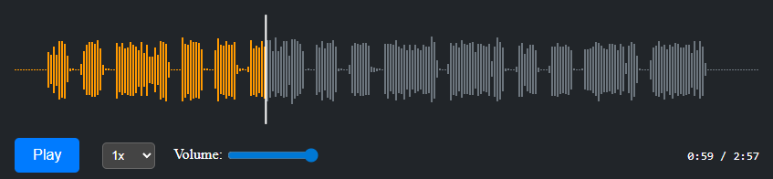

# streamlit-wavesurfer-player

Streamlit Component that wraps wavesurfer.js to render interactive audio waveforms, seek/play audio, and expose playback events to Python.



## Features

- Render an audio waveform from an audio file or URL using wavesurfer.js
- Play, pause and seek programmatically from Python
- Emit playback position and events back to the Streamlit app

## Prerequisites

- Python 3.9+ (3.10 recommended)
- Node.js and npm (for frontend build/dev)
- Streamlit (install into a virtualenv)

On Windows PowerShell use the following as examples for creating a virtual environment and activating it:

```powershell
python -m venv .venv
.\.venv\Scripts\activate.ps1
pip install -r requirements.txt
```

If your project isolates component requirements, install them inside the component folder instead.

## Quickstart — development (frontend + example app)

This component follows the Streamlit Components pattern: a Python API that declares the component and a separate frontend (built with any web tooling) that is loaded by Streamlit.

1. Start the frontend dev server

   Open a terminal in `wavesurfer_player/frontend` and run:

```powershell
cd wavesurfer_player\frontend
npm install
npm run start
```

   This should start a dev server (Vite, webpack-dev-server, or similar) and serve the component UI for local development.

2. In another terminal, activate your Python virtualenv and install the component package in editable mode

```powershell
.\.venv\Scripts\activate.ps1   # or the venv you created earlier
pip install -e .
```

3. Run the example Streamlit app

```powershell
streamlit run example.py
```

Open the Streamlit app in your browser. When the frontend dev server is running, the component will load the local frontend build automatically and you can edit frontend code with hot reload.

## Building the frontend for production

When you're ready to bundle the frontend into static assets for distribution or offline use, build the frontend and ensure the Python package points to the built files (commonly `frontend/build`):

```powershell
cd wavesurfer_player\frontend
npm run build

# Then in the component package (root of this folder) install normally or rebuild the package
cd ..
pip install -e .
```

The built frontend will be placed under `frontend/dist` or `frontend/build` depending on the project config — ensure the `declare_component(..., path="frontend/build")` path in the Python package points to the correct folder.

## Example usage

In your Streamlit app you can declare and use the component like this (example outline):

```python
import streamlit as st
from wavesurfer_player import wavesurfer_player

pos = wavesurfer_player(audio_url="https://example.com/audio.mp3", width=800)
st.write("Playback position:", pos)
```

## Contributing

If you'd like to contribute, run the frontend dev server and the example app locally, make changes, and open a PR.

## More information

- Streamlit Components documentation: https://docs.streamlit.io/library/components
- wavesurfer.js: https://wavesurfer-js.org/
